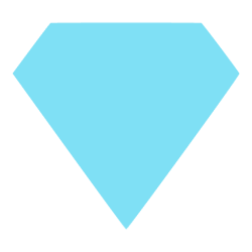

<!--
*** Thanks for checking out the Best-README-Template. If you have a suggestion
*** that would make this better, please fork the repo and create a pull request
*** or simply open an issue with the tag "enhancement".
*** Don't forget to give the project a star!
*** Thanks again! Now go create something AMAZING! :D
-->

<!-- PROJECT SHIELDS -->
<!--
*** I'm using markdown "reference style" links for readability.
*** Reference links are enclosed in brackets [ ] instead of parentheses ( ).
*** See the bottom of this document for the declaration of the reference variables
*** for contributors-url, forks-url, etc. This is an optional, concise syntax you may use.
*** https://www.markdownguide.org/basic-syntax/#reference-style-links
-->
<!-- [![Contributors][contributors-shield]][contributors-url] [![Forks][forks-shield]][forks-url] [![Stargazers][stars-shield]][stars-url] [![Issues][issues-shield]][issues-url] [![MIT License][license-shield]][license-url] [![LinkedIn][linkedin-shield]][linkedin-url] -->

<!-- PROJECT LOGO -->
 

  

<h3 align="center">Personal Portfolio 2022</h3>

  

    A personal portfolio to showcase my work for potential employers.
     
     
    <a href="https://github.com/samd1a/portfolio">View Demo</a>
    ·
    <a href="https://github.com/samd1a/portfolio/issues">Report Bug</a>
    ·
    <a href="https://github.com/samd1a/portfolio/issues">Request Feature</a>
  

<!-- TABLE OF CONTENTS -->

  
Table of Contents

  <ol>
    <li>
      <a href="#about-the-project">About The Project</a>
      <ul>
        <li><a href="#built-with">Built With</a></li>
      </ul>
    </li>
    <li><a href="#roadmap">Roadmap</a></li>
    <li><a href="#contributing">Contributing</a></li>
    <li><a href="#license">License</a></li>
    <li><a href="#contact">Contact</a></li>
  </ol>

<!-- ABOUT THE PROJECT -->
## About The Project

[![Sam Diamond Portfolio][product-screenshot]](https://samdia.cf)

### Built With

* [![SASS][SASS.com]][SASS-URL]
* [![Web Components][web-components]][Web-components-URL]

<!-- ROADMAP -->
## Roadmap

- [x] Reusable Footer and Nav
- [ ] Connect email form to netlify
- [ ] Blog using Notion as a CMS

See the [open issues](https://github.com/samd1a/portfolio/issues) for a full list of proposed features (and known issues).

<!-- CONTRIBUTING -->
## Contributing

Contributions are what make the open source community such an amazing place to learn, inspire, and create. Any contributions you make are **greatly appreciated**.

If you have a suggestion that would make this better, please fork the repo and create a pull request. You can also simply open an issue with the tag "enhancement".
Don't forget to give the project a star! Thanks again!

1. Fork the Project
2. Create your Feature Branch (`git checkout -b feature/AmazingFeature`)
3. Commit your Changes (`git commit -m 'Add some AmazingFeature'`)
4. Push to the Branch (`git push origin feature/AmazingFeature`)
5. Open a Pull Request

<!-- LICENSE -->
## License

Distributed under the MIT License. See `LICENSE.txt` for more information.

<!-- CONTACT -->
## Contact

Sam Diamond - [@samd1a](https://twitter.com/samd1a) - sam@samdia.cf

Project Link: [https://github.com/samd1a/portfolio](https://github.com/samd1a/portfolio)

<!-- MARKDOWN LINKS & IMAGES -->
<!-- https://www.markdownguide.org/basic-syntax/#reference-style-links -->
[contributors-shield]: https://img.shields.io/github/contributors/samd1a/portfolio.svg?style=for-the-badge
[contributors-url]: https://github.com/samd1a/portfolio/graphs/contributors
[forks-shield]: https://img.shields.io/github/forks/samd1a/portfolio.svg?style=for-the-badge
[forks-url]: https://github.com/samd1a/portfolio/network/members
[stars-shield]: https://img.shields.io/github/stars/samd1a/portfolio.svg?style=for-the-badge
[stars-url]: https://github.com/samd1a/portfolio/stargazers
[issues-shield]: https://img.shields.io/github/issues/samd1a/portfolio.svg?style=for-the-badge
[issues-url]: https://github.com/samd1a/portfolio/issues
[license-shield]: https://img.shields.io/github/license/samd1a/portfolio.svg?style=for-the-badge
[license-url]: https://github.com/samd1a/portfolio/blob/master/LICENSE.txt
[linkedin-shield]: https://img.shields.io/badge/-LinkedIn-black.svg?style=for-the-badge&logo=linkedin&colorB=555
[linkedin-url]: https://linkedin.com/in/samd1a
[product-screenshot]: assets/img/thumbnail/index.webp
[Next.js]: https://img.shields.io/badge/next.js-000000?style=for-the-badge&logo=nextdotjs&logoColor=white
[Next-url]: https://nextjs.org/
[React.js]: https://img.shields.io/badge/React-20232A?style=for-the-badge&logo=react&logoColor=61DAFB
[React-url]: https://reactjs.org/
[Vue.js]: https://img.shields.io/badge/Vue.js-35495E?style=for-the-badge&logo=vuedotjs&logoColor=4FC08D
[Vue-url]: https://vuejs.org/
[Angular.io]: https://img.shields.io/badge/Angular-DD0031?style=for-the-badge&logo=angular&logoColor=white
[Angular-url]: https://angular.io/
[Svelte.dev]: https://img.shields.io/badge/Svelte-4A4A55?style=for-the-badge&logo=svelte&logoColor=FF3E00
[Svelte-url]: https://svelte.dev/
[Laravel.com]: https://img.shields.io/badge/Laravel-FF2D20?style=for-the-badge&logo=laravel&logoColor=white
[Laravel-url]: https://laravel.com
[Bootstrap.com]: https://img.shields.io/badge/Bootstrap-563D7C?style=for-the-badge&logo=bootstrap&logoColor=white
[Bootstrap-url]: https://getbootstrap.com
[JQuery.com]: https://img.shields.io/badge/jQuery-0769AD?style=for-the-badge&logo=jquery&logoColor=white
[JQuery-url]: https://jquery.com 
[SASS.com]: https://img.shields.io/badge/-SASS-f1f1f1?style=for-the-badge&logo=sass
[SASS-url]: https://sass-lang.com
[Web-Components]: https://img.shields.io/badge/-Web%20Components-f1f1f1?logo=webcomponentsdotorg&style=for-the-badge
[Web-Components-URL]: https://webcomponents.org
